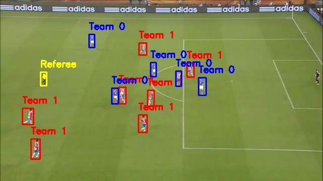
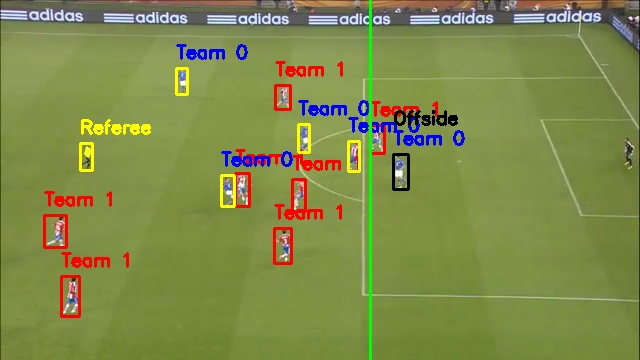

# AI Offside Checker (YOLOv8)

Lightweight, proof‑of‑concept offside assistant that:

- Detects players in a football frame using YOLOv8
- Clusters players into two teams via jersey color (HSV hue)
- Heuristically identifies the referee
- Draws an offside line based on the defensive line
- Flags attackers beyond that line as offside

This repo works on a single extracted frame from a video. It is a learning/demo project, not a full VAR replacement.




---

## Features

- Player detection with Ultralytics YOLOv8n
- Team assignment using KMeans on torso hue
- Simple referee filtering via adaptive hue thresholding
- Offside line from the deepest defender (see limitations)
- Minimal CLI prompts to pick the frame time and attacking team

## How It Works

1. Extract a frame at a user‑provided timestamp from `videos/sample_clip.mp4`.
2. Run YOLOv8 on the frame to get person bounding boxes.
3. For each detected person, crop the upper half (torso), convert to HSV, and compute the average hue.
4. Cluster the hue values into 2 groups (teams) using KMeans.
5. Mark boxes as Team 0 or Team 1; boxes far from both hue centers are labeled as “Referee”.
6. Ask the user which team is attacking (0 or 1), then:
   - Find the deepest defender along the x‑axis and draw the vertical offside line.
   - Mark attackers beyond that line as offside.
7. Save visualizations to `outputs/`.

## Repository Structure

```
.
├── main.py                      # Entry point with simple CLI prompts
├── requirements.txt             # Python dependencies
├── models/
│   └── yolov8n.pt              # YOLOv8n weights (expected path)
├── videos/
│   └── sample_clip.mp4         # Example input video
├── outputs/
│   ├── team_labeled.jpg        # Team/referee labels per player
│   └── offside_result.jpg      # Offside line and flags
└── README.md
```

## Prerequisites

- Python 3.9+ (tested on CPython)
- A working C++ toolchain and FFmpeg may be required by OpenCV for some platforms
- GPU is optional; CPU inference works but is slower

## Setup

1. Create and activate a virtual environment (recommended):

   ```bash
   python -m venv .venv
   source .venv/bin/activate  # Windows: .venv\Scripts\activate
   ```

2. Install dependencies:

   ```bash
   pip install -r requirements.txt
   ```

3. Model weights:

   - The code expects YOLOv8n weights at `models/yolov8n.pt`.
   - If that file is missing, download the official `yolov8n.pt` from Ultralytics and place it there, or update `main.py` to point to your weight path.

## Usage

Run the script and follow the prompts:

```bash
python main.py
```

You will be asked for:

- Second in the video to extract a frame from (float is accepted)
- Which team is attacking (`0` or `1`) after clustering

Outputs are saved to `outputs/team_labeled.jpg` and `outputs/offside_result.jpg`.

## Configuration

- Input video: edit `input_video` in `main.py` (default: `videos/sample_clip.mp4`).
- Model path: edit the argument to `YOLO("models/yolov8n.pt")` in `main.py`.

## Notes and Limitations

- Single frame only: no tracking, no ball detection, no temporal context.
- Perspective not handled: the offside line is drawn as a vertical pixel line, not a perspective‑aware line mapped to the field.
- Team colors: clustering relies on jersey hue; similar colors or lighting changes can cause misclassification.
- Referee detection is heuristic: non‑team outliers in hue are marked as “Referee”.
- Offside rule simplification: true offside is judged against the second‑last defender and the ball at the moment it is played. This demo currently draws the line using the deepest defender by x‑coordinate and compares attacker x‑positions to that line. Camera orientation can invert this logic depending on where the defending goal is in the frame.

If you plan to extend this project, consider:

- Using the second‑last defender for the offside line
- Estimating pitch lines and a homography to draw perspective‑correct lines
- Adding ball detection and player tracking across frames
- More robust team/referee classification (e.g., color ranges per kit, person re‑ID, or fine‑tuned models)
- Auto‑detecting attacking direction from context

## Troubleshooting

- Torch/CUDA: Ultralytics depends on PyTorch; for GPU, install the correct CUDA‑enabled PyTorch build from the official instructions.
- OpenCV video I/O: if the video fails to open, ensure FFmpeg is installed and the path is correct.
- Model not found: verify `models/yolov8n.pt` exists or update the model path in `main.py`.

## Acknowledgements

- Player detection powered by Ultralytics YOLOv8: https://github.com/ultralytics/ultralytics
- OpenCV for image/video processing
- scikit‑learn for KMeans clustering

## License

No license specified. If you plan to publish or share, add a suitable license file.
